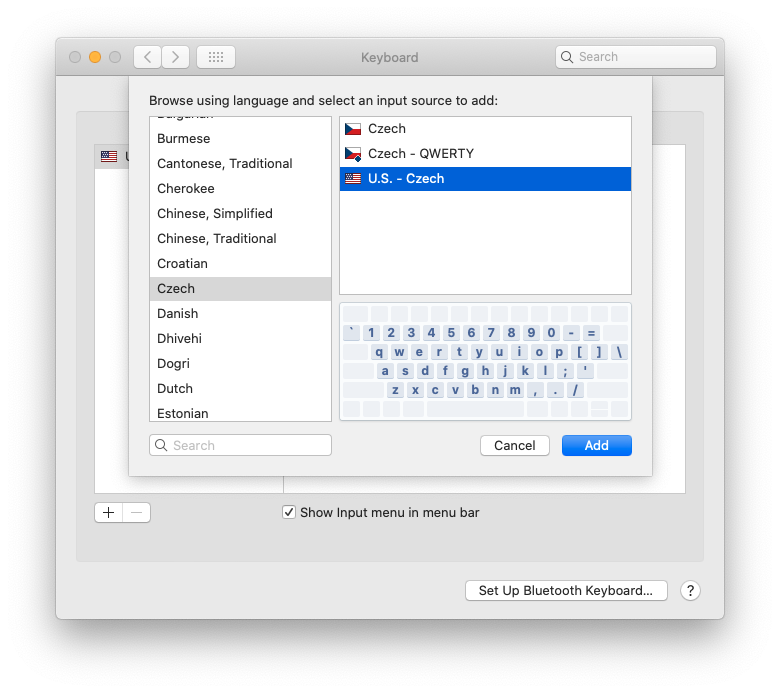
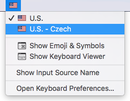
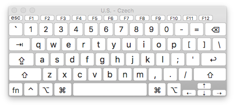
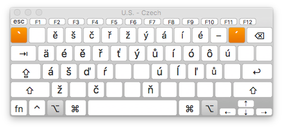
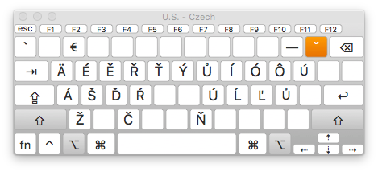

# U.S. – Czech keyboard layout for macOS

Ideal keyboard layout (not only) for Czech programmers.

## Installation

Type the following commands in Terminal:

    cd ~/Downloads
    curl -OJ https://codeload.github.com/mariancerny/us-czech-keyboard-layout/zip/master
    unzip us-czech-keyboard-layout-master.zip
    sh us-czech-keyboard-layout-master/install.sh

Add the new layout as an input source in `System Preferences` > `Keyboard` > `Input Sources`:

Switch to new layout in Input menu in the menu bar

or remove other layous (you won't need other layouts any more).

If this is your first install, the new layout should work right away.
If you are updating the layout, you need to log out or restart the computer.

## Layout

Standard US layout:

Czech lower case characters with <kbd>⌥ Option</kbd> modifier:

Czech upper case characters with <kbd>⌥ Option</kbd> <kbd>⇧ Shift</kbd> modifiers:

